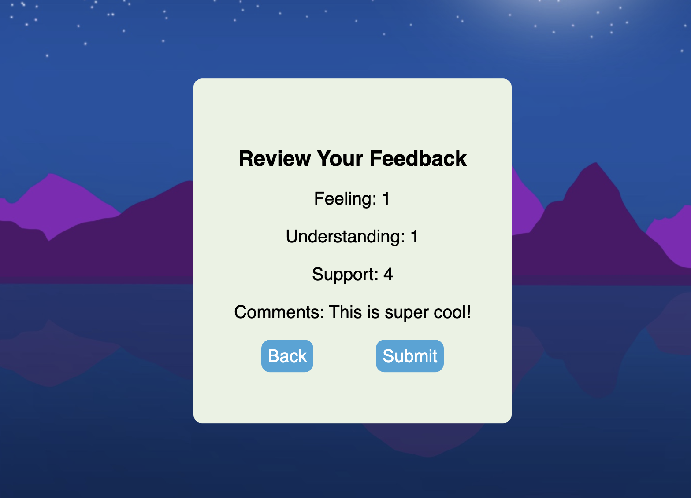
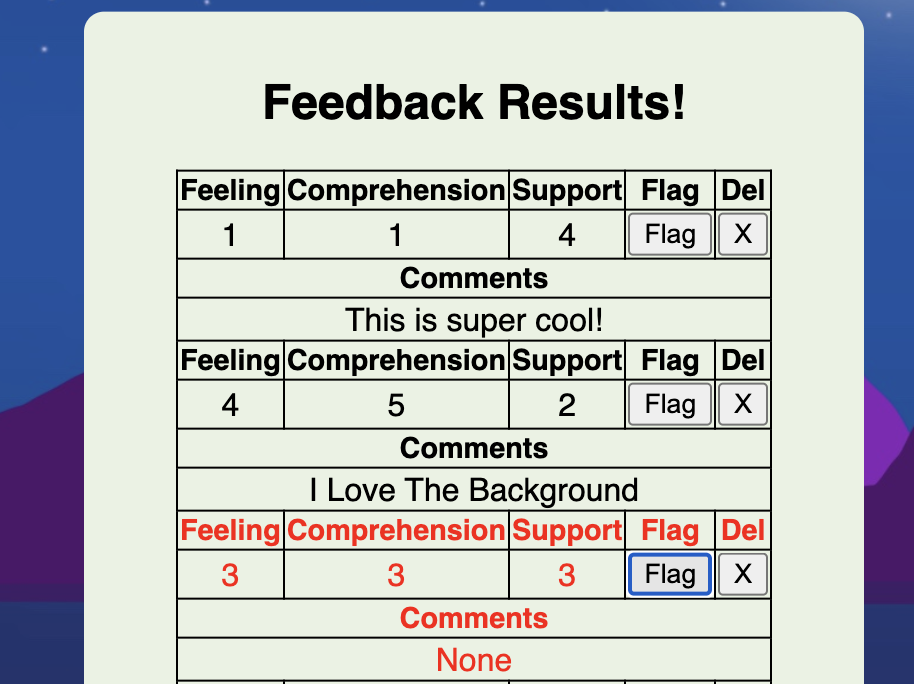

# Redux Feedback Loop

## Description

_Duration: 2 Day Sprint_

This application is meant to emulate a form / feedback loop. The user may fill out inputs throughout the form and store their responses onto a database. This particular form is meant to guage how someone is doing over a period of time while in a learning environment. 

## Preview

## Usage

The guages mentioned are choices between 1 meaning terrible, and 5 meaning excellent.

1. The user may fill out the form starting with the `feeling` page. Here the user may select a number from one to five and then     select the `next` button.
    

2. The next two pages will have the same guage but measure level of `understanding` and level of `support` navigable through the use of the `next` and `back` buttons.
    

3. On the fourth page the user may enter in an optional `comment` for the day.
    

4. After choosing to enter a comment or not the user will be directed to the `review` page.
    - Here the selections for each part of the form are shown.
    

5. On the `review` page the user may select `submit` to submit the form to the database.
    - upon click of the `submit` button the user is shown a confirmation modal.
    
    - After selecting `submit` the success box will appear with three buttons.
    
    - Selecting `New Feedback` will allow the user to submit another form.
    - Selecting `Exit` will redirect the user to https://google.com.
    - Selecting `Meme` will promptly send the user to a page that is inescapable where they will be subjected to a clockwise spinning gorilla.

## Extra Features

One may edit the url by putting `admin` after the slash to reach the beautifully disgusting admin page.

Here one may view all entries submitted to the form database and completely mess things up by:
1. `flagging` entries for review.
    

2. `deleting` all of the entries for fun.
    

After deleting all the entries you can hope for a new entry to pop in and then proceed to delete that one!

## Prerequisites

Can't forget these:

-[node js](https://nodejs.org/en/)

-[npm](https://docs.npmjs.com/)

## Built With

-[React](https://reactjs.org/)

-[React-Redux](https://react-redux.js.org/)

-[Sweetalert](https://sweetalert.js.org/)

## Acknowledgement
Thanks to [Emerging Digital Academy](https://emergingacademy.org/) for supplying me with the resources to complete this project.

Also thanks to Nathaniel Moy for supplying me with an awesome background image.

## Support
If you have any questions, suggestions, or issues, please email me at [david.wesley.lindberg@gmail.com](www.google.com)